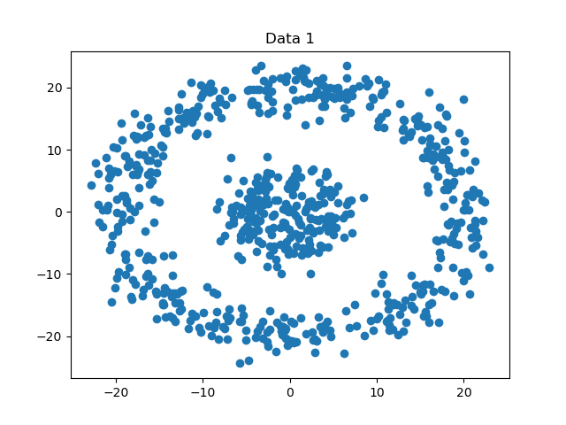
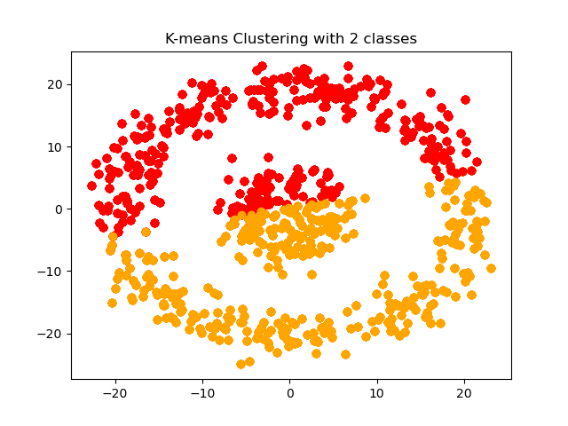
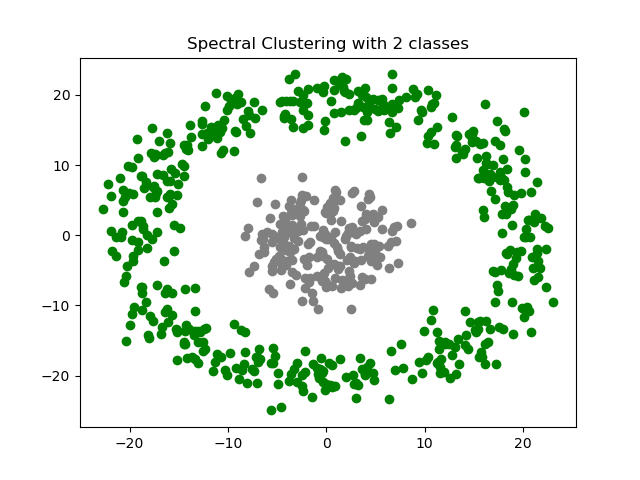
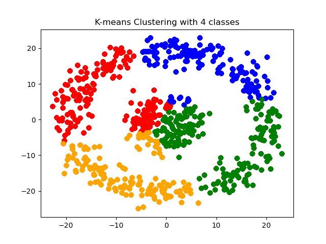
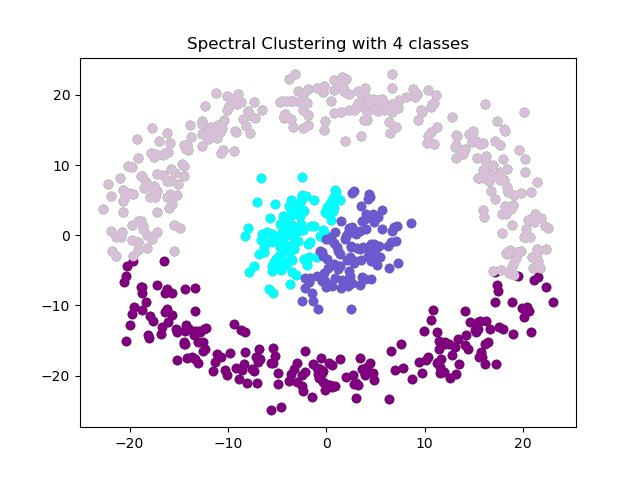
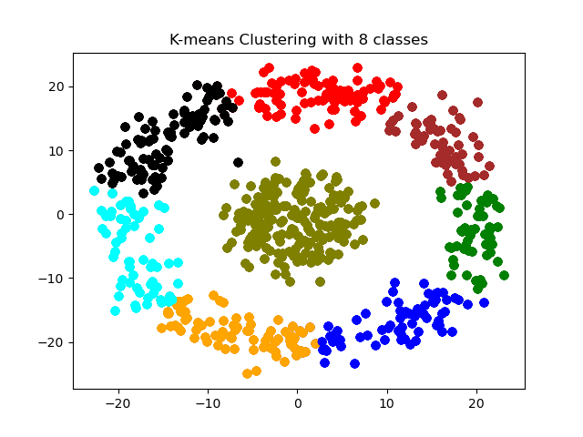
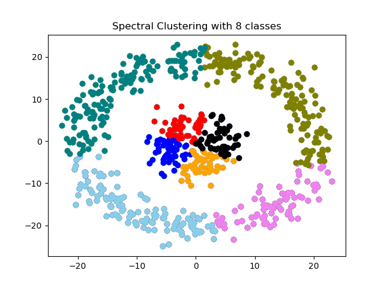

# Spectral Clustering (with hierarchical clustering) and K-means

## About
This project is implemented on a toy dataset for K-means algorithm and Spectral Clustering Algorithm with hierarchical clustering.

## Instructions to run the code:
1. Clone the repository using 
```
git clone https://github.com/Abhishek-Nalawade/Spectral-Clustering-and-K-means
```
2. Run the code Execute_comparison.py to compare both the methods for a certain number of classes (2, 4 or 8).
3. Run the code plot_costs.py to plot the costs for both methods for 3 different nmuber of classes (2, 4 or 8) at once. The plot_costs.py code measures the cost as a result of the clusters formed using a criterion function.

## Results:
It can be seen that for the dataset with circular trends Kmeans fails to cluster the data correctly whereas Spectral Clustering does it effectively
\
\
 \


### Clustering with 2 classes
<p float="left">
  
  
</p>

### Clustering with 4 classes
<p float="left">
  
  
</p>

### Clustering with 8 classes
<p float="left">
  
  
</p>

## Notes:
1. The results obtained from K-means are not always consistent, because of the random initialization of the initial centroids the clusters formed can be different.
